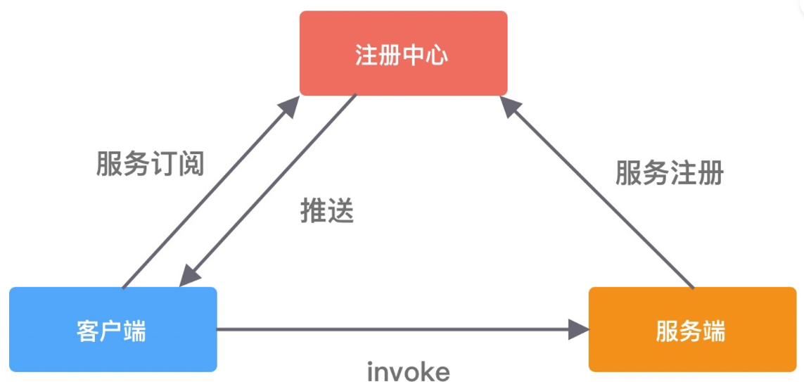

这是一个RPC项目的简易实现。
RPC框架时后端研发人员使用的重要框架，目前业界比较知名有 Dubbo、Spring Cloud、gRPC 等，
本文参照Dubbo框架，实现自己的RPC框架。

<h3>RPC框架的结构</h3>
基本的RPC框架包括三部分，注册中心、服务端、客户端。以下是一个最简单的结构流程图。

##### 组成部分：

* 1、注册中心：用于注册和获取服务。
* 2、服务端：指提供服务的一方，也叫服务提供方 Provider
* 3、客户端：指调用服务的一方，也叫服务消费者 Consumer

##### 流程：

1. 服务端把服务信息注册到注册中心，通常包含服务端地址、接口类和方法
2. 客户端从注册中心获取对应服务的信息
3. 客户端根据服务的信息，通过网络调用到服务端的接口

